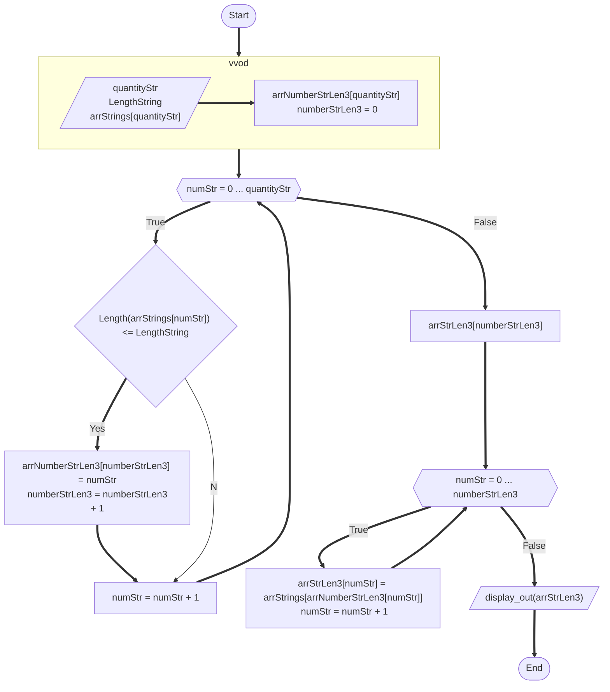

```mermaid

%% Задача:
%% Написать программу, которая из имеющегося массива строк формирует новый массив из строк, длина которых меньше, либо равна 3 символам. 
%% Первоначальный массив можно ввести с клавиатуры, либо задать на старте выполнения алгоритма. 
%% При решении не рекомендуется пользоваться коллекциями, лучше обойтись исключительно массивами.

flowchart TD
    A([Start])
    subgraph vvod
    B[/"quantityStr\n LengthString\n arrStrings[quantityStr]\n"/]
    ==>C["arrNumberStrLen3[quantityStr]\n numberStrLen3 = 0\n"]
    end
    D{{numStr = 0 ... quantityStr}}
    D==True==>E{"Length(arrStrings[numStr]) <= LengthString"}
    E==Yes==>G["arrNumberStrLen3[numberStrLen3] = numStr\n numberStrLen3 = numberStrLen3 + 1"]==>F
    E==No==>F["numStr = numStr + 1"]==>D
    D==False==>H["arrStrLen3[numberStrLen3]\n"]==>J{{numStr = 0 ... numberStrLen3}}
    J==True==>K["arrStrLen3[numStr] = arrStrings[arrNumberStrLen3[numStr]]\n numStr = numStr + 1"]==>J
    J==False==>M[/"display_out(arrStrLen3)"/]==>N([End])
    A==>vvod==>D
```
